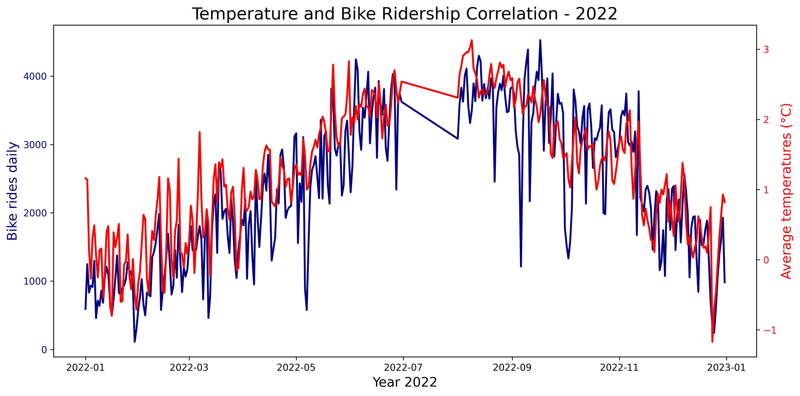
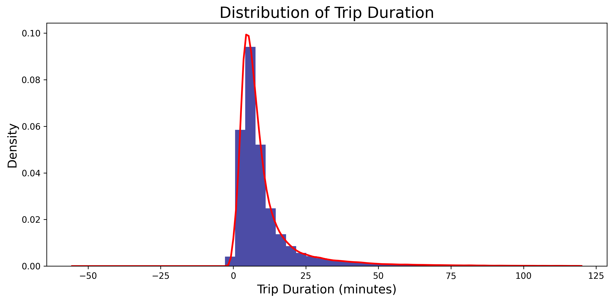
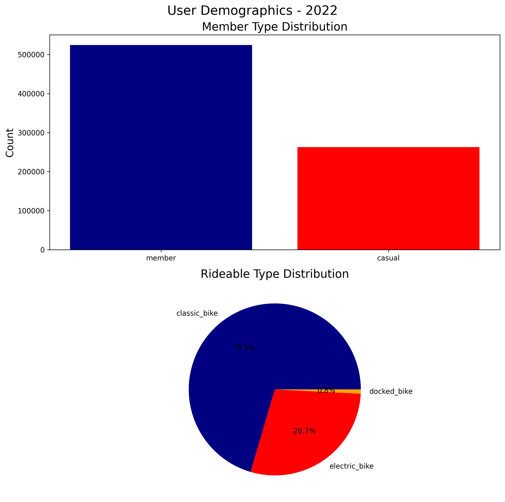

# Citi Bike NYC Expansion Dashboard

Strategic data analytics project for optimizing Citi Bike's network expansion through data-driven station placement recommendations.

## Overview

This analysis leverages 2022 Citi Bike trip data combined with meteorological information to identify optimal locations for new bike-sharing stations in New York City. The project employs statistical analysis and visualization techniques to maximize infrastructure ROI and improve service coverage.

### Problem Statement

Current bike shortages at high-traffic stations indicate insufficient supply relative to demand. This project addresses the network expansion challenge by quantifying usage patterns, identifying underserved areas, and providing actionable recommendations for strategic station placement.

## Key Visualizations

### Weather Impact on Ridership



**Finding:** Strong positive correlation between temperature and bike usage. Ridership increases 3-4x from winter to summer months, indicating significant seasonal demand variation.

**Implication:** New stations must accommodate large capacity swings. Expansion areas should prioritize locations with year-round activity potential or weather-protected routes.

---

### Trip Duration Patterns



**Finding:** Modal trip duration of 10-15 minutes indicates primary use for short point-to-point trips. Distribution is right-skewed with most trips under 30 minutes.

**Implication:** Station spacing should support 1-2 km coverage radius. High-turnover areas require greater docking capacity.

---

### User Demographics



**Finding:** Member riders significantly outnumber casual users, indicating stable subscription-driven revenue. Classic bikes dominate fleet preferences.

**Implication:** Target expansion areas with membership conversion potential (residential/office districts) for steady ROI. Initial fleet composition can prioritize standard bikes.

---

## Research Objectives

The analysis addresses four key questions:

1. **Station Demand Analysis**: Identify high-traffic stations experiencing capacity constraints
2. **Weather Impact Assessment**: Quantify seasonal and weather-related effects on ridership patterns
3. **Route Optimization**: Map frequently traveled corridors to identify network gaps
4. **Coverage Analysis**: Evaluate geographic distribution and identify underserved areas

## Repository Structure

```
citibike-expansion-dashboard/
├── citibike_data_collection.ipynb       # Exercise 2.2: Data collection & API integration
├── citibike_visualization_enhanced.ipynb # Exercise 2.3: Matplotlib visualizations
├── data/                                 # Source data files (excluded from VCS)
│   ├── JC-202201-citibike-tripdata.csv
│   └── ... (12 monthly files)
├── outputs/                              # Generated datasets and visualizations
│   ├── merged_citibike_weather_2022.csv
│   ├── weather_data_2022.csv
│   ├── dual_axis_chart.png
│   ├── trip_duration_histogram.png
│   └── user_demographics.png
├── .gitignore                           # Version control exclusions
└── README.md                            # Project documentation
```

## Technical Stack

- **Python 3.13** - Core programming environment
- **pandas 3.0.0** - Data manipulation and analysis
- **matplotlib 3.x** - Data visualization
- **requests 2.32.5** - HTTP client for API integration
- **scipy 1.17.0** - Statistical analysis (KDE for histograms)
- **json** - JSON parsing and serialization
- **datetime** - Temporal data handling
- **JupyterLab** - Interactive development environment

## Data Sources

### Primary Dataset
- **Provider**: Citi Bike System Data
- **Temporal Coverage**: January 2022 - December 2022
- **Records**: Approximately 786,983 trip records
- **Geographic Scope**: Jersey City, NJ
- **Format**: 12 monthly CSV files
- **Access**: [Citi Bike System Data Portal](https://citibikenyc.com/system-data)

### Supplementary Dataset
- **Provider**: NOAA Climate Data Online (CDO) API
- **Station**: LaGuardia Airport Weather Station (ID: GHCND:USW00014732)
- **Temporal Coverage**: January 1, 2022 - December 31, 2022
- **Metrics**: Daily average temperature (TAVG)
- **Access**: [NOAA CDO Web Services](https://www.ncdc.noaa.gov/cdo-web/webservices/v2)

## Setup and Installation

### Prerequisites

- Python 3.8 or higher
- Git version control
- NOAA API authentication token

### Installation Steps

1. Clone the repository
   ```bash
   git clone https://github.com/pm-ssingh/citibike-expansion-dashboard.git
   cd citibike-expansion-dashboard
   ```

2. Configure Python virtual environment
   ```bash
   python -m venv citibike_env
   source citibike_env/bin/activate  # Unix/MacOS
   citibike_env\Scripts\activate     # Windows
   ```

3. Install dependencies
   ```bash
   pip install pandas requests matplotlib scipy jupyterlab
   ```

4. Acquire source data
   - Download 12 monthly CSV files from Citi Bike System Data portal
   - Create `data/` directory in project root
   - Place all CSV files in `data/` directory

5. Configure API authentication
   - Request authentication token from NOAA CDO Web Services
   - Open `citibike_data_collection.ipynb`
   - Update token variable with your credentials

### Execution

1. Launch Jupyter Lab environment
   ```bash
   jupyter lab
   ```

2. Execute analysis notebooks in order
   - **Exercise 2.2**: `citibike_data_collection.ipynb` (data collection)
   - **Exercise 2.3**: `citibike_visualization_enhanced.ipynb` (visualization)

3. Output artifacts
   - `merged_citibike_weather_2022.csv` - Integrated trip and weather dataset
   - `weather_data_2022.csv` - Daily temperature records
   - Visualization PNG files in `outputs/` directory

## Methodology

### Data Ingestion

The data collection pipeline implements efficient file handling through:
- List comprehension with `os.listdir()` for dynamic file discovery
- Generator expressions with `pd.concat()` for memory-efficient batch processing
- RESTful API integration with NOAA CDO for meteorological data retrieval

### Data Transformation

Processing workflow includes:
1. **Weather Data Extraction**: Parse JSON API response to extract temporal and temperature fields
2. **Date Normalization**: Convert ISO 8601 timestamps to date objects for join operations
3. **Unit Conversion**: Transform NOAA temperature values (stored as tenths of Celsius) to standard Celsius
4. **Dataset Integration**: Perform left join on date field with merge quality validation

### Visualization Strategy

Created four key visualizations using matplotlib:
1. **Temperature time series** (procedural approach) - Seasonal baseline
2. **Dual-axis chart** (object-oriented approach) - Weather-ridership correlation
3. **Trip duration histogram** with KDE - Usage pattern analysis
4. **Demographics subplots** (bar + pie charts) - User profiling

### Quality Assurance

The pipeline implements multiple validation checkpoints:
- Merge indicator analysis confirms 100% join success rate
- Head/tail inspection validates data integrity across time series
- Shape validation ensures complete record processing
- Statistical summary confirms data distribution expectations

## Key Findings

### 1. Weather Sensitivity (Critical)
- **Observation**: Strong positive correlation between temperature and ridership
- **Magnitude**: 3-4x demand variation between summer peak and winter low
- **Implication**: New stations must handle large seasonal capacity swings
- **Risk Factor**: Weather dependency creates revenue volatility

### 2. Trip Patterns (Important)
- **Observation**: Modal duration 10-15 minutes, primarily short-distance trips
- **Implication**: Station spacing should support 1-2 km coverage radius
- **Infrastructure Need**: High turnover areas require greater docking capacity
- **Network Effect**: Dense station network needed for utility

### 3. User Profile (Opportunity)
- **Observation**: Member-dominated user base, classic bike preference
- **Implication**: Expansion areas with membership potential offer best ROI
- **Infrastructure Cost**: Lower initial investment (standard bikes sufficient)
- **Revenue Stability**: Subscription model provides predictable cash flow

## Expansion Strategy Recommendations

### High-Priority Criteria for New Stations
1. Within 10-15 minute ride of high-traffic destinations
2. Areas with potential for membership conversion (residential/office)
3. Some weather protection (covered routes, indoor destinations)
4. Sufficient space for seasonal capacity scaling

### Infrastructure Requirements
- 3-4x docking capacity variation for summer vs. winter
- Initially standard bikes, add electric based on topography
- Real-time availability monitoring (given tight duration patterns)
- Flexible capacity management for seasonal demand

### Target Demographics
- Commuter-focused areas (office districts, transit hubs)
- Residential neighborhoods with membership potential
- Areas within 1-2 km of existing stations (network density)
- Locations with year-round activity (reduced weather sensitivity)

## Future Work

1. **Geographic Analysis**: Map current station locations vs. demand heat maps
2. **Route Analysis**: Identify most popular origin-destination pairs
3. **Gap Analysis**: Find underserved areas meeting expansion criteria
4. **Financial Modeling**: Project ROI for candidate locations
5. **Machine Learning**: Predictive models for demand forecasting
6. **Interactive Dashboard**: Real-time visualization of expansion opportunities

## Author

**Saurabh Singh**  
GitHub: [@pm-ssingh](https://github.com/pm-ssingh)

**Academic Context**: CareerFoundry Data Visualization Specialization  
**Completed Exercises**: 
- Achievement 2, Exercise 2.2 (Data Collection & API Integration)
- Achievement 2, Exercise 2.3 (Matplotlib Visualization)

## License

This project is developed for educational purposes as part of the CareerFoundry Data Visualization with Python specialization program.

## Acknowledgments

- Citi Bike for providing open-access trip data
- National Oceanic and Atmospheric Administration (NOAA) for meteorological data access
- CareerFoundry for curriculum design and project guidance

## Contact

For inquiries regarding this analysis, please submit an issue through the GitHub repository issue tracker.

---

**Last Updated**: February 2026  
**Version**: 2.0.0  
**Status**: Active Development - Visualization Phase Complete
